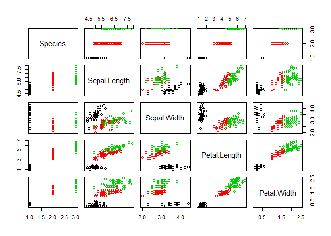
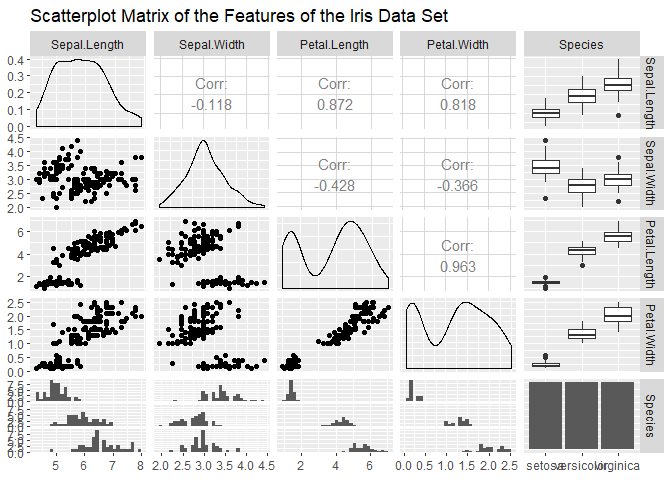
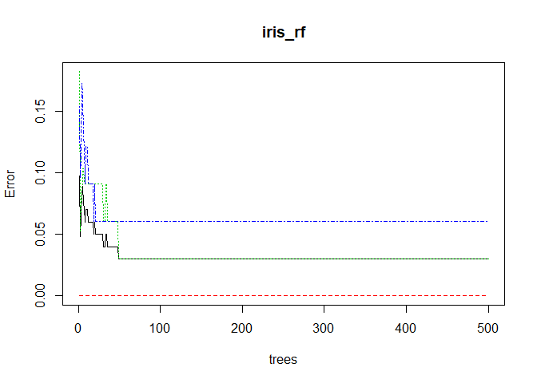
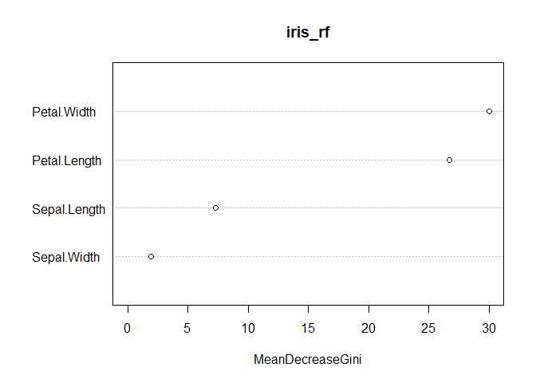
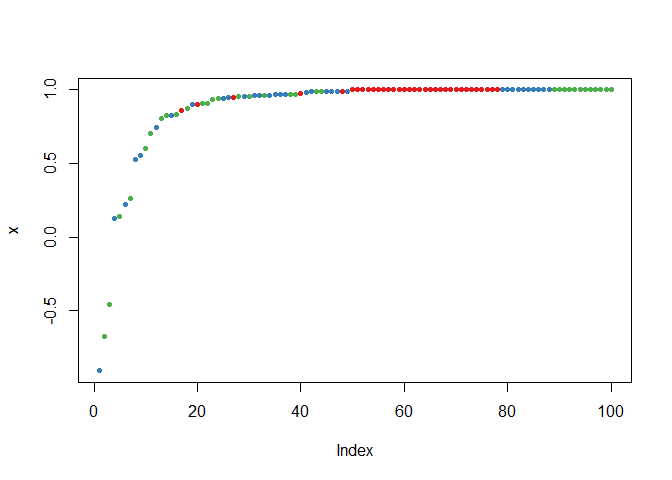

Neural Network & Random Forest
================
Erika Vargas
March 5, 2019

``` r
#loading necessary libraries to conduct neural network algorithm 
library(neuralnet)
library(GGally)
```

    ## Loading required package: ggplot2

``` r
library(tidyverse)
```

    ## -- Attaching packages -------------------------------------------- tidyverse 1.2.1 --

    ## v tibble  1.4.2     v purrr   0.2.5
    ## v tidyr   0.8.2     v dplyr   0.7.8
    ## v readr   1.3.1     v stringr 1.4.0
    ## v tibble  1.4.2     v forcats 0.3.0

    ## -- Conflicts ----------------------------------------------- tidyverse_conflicts() --
    ## x dplyr::compute() masks neuralnet::compute()
    ## x dplyr::filter()  masks stats::filter()
    ## x dplyr::lag()     masks stats::lag()

``` r
library(caret)
```

    ## Loading required package: lattice

    ## 
    ## Attaching package: 'caret'

    ## The following object is masked from 'package:purrr':
    ## 
    ##     lift

``` r
#loading the data(using iris dataset)
data(iris)
head(iris, 3)
```

    ##   Sepal.Length Sepal.Width Petal.Length Petal.Width Species
    ## 1          5.1         3.5          1.4         0.2  setosa
    ## 2          4.9         3.0          1.4         0.2  setosa
    ## 3          4.7         3.2          1.3         0.2  setosa

``` r
summary(iris)
```

    ##   Sepal.Length    Sepal.Width     Petal.Length    Petal.Width   
    ##  Min.   :4.300   Min.   :2.000   Min.   :1.000   Min.   :0.100  
    ##  1st Qu.:5.100   1st Qu.:2.800   1st Qu.:1.600   1st Qu.:0.300  
    ##  Median :5.800   Median :3.000   Median :4.350   Median :1.300  
    ##  Mean   :5.843   Mean   :3.057   Mean   :3.758   Mean   :1.199  
    ##  3rd Qu.:6.400   3rd Qu.:3.300   3rd Qu.:5.100   3rd Qu.:1.800  
    ##  Max.   :7.900   Max.   :4.400   Max.   :6.900   Max.   :2.500  
    ##        Species  
    ##  setosa    :50  
    ##  versicolor:50  
    ##  virginica :50  
    ##                 
    ##                 
    ## 

*The data set contains 3 classes (setosa, versicolor, and virginica) of 50 instances each, where each class refers to a type of iris plant. Four features were measured from each sample: the length and the width of the sepals and petals, in centimeters.*

``` r
pairs(Species~., data=iris, col=iris$Species)
```



*There is a high correlation between the sepal length and the sepal width of the Setosa iris flowers, while the correlation is somewhat less high for the Virginica and Versicolor flowers.* *The graph indicates a positive correlation between the petal length and the petal width for all different species that are included into the “iris” data set.* *The scatter plots reveal a strong classification criteria. Setosa has the smallest petals versicolor has medium-sized petals and virginica has the largest petals.*

``` r
ggpairs(iris, title = "Scatterplot Matrix of the Features of the Iris Data Set")
```

    ## `stat_bin()` using `bins = 30`. Pick better value with `binwidth`.
    ## `stat_bin()` using `bins = 30`. Pick better value with `binwidth`.
    ## `stat_bin()` using `bins = 30`. Pick better value with `binwidth`.
    ## `stat_bin()` using `bins = 30`. Pick better value with `binwidth`.



*we can see that setosa has quite different mean and sd values from the other two species, especially for petal length and petal width.* *we see from the plot above that sepal length and sepal width do not vary much across species, however, petal length and petal width are quite different for different species.* *petal length of versicolor and virginica are approximately normally distributed with different means and similar variability. Also, species setosa lies far away from these two species.*

### test and training datasets

``` r
#building training and testing dataset
data <- which(1:length(iris[,1])%%3 == 0)
iristrain <- iris[-data,]
dim(iristrain)
```

    ## [1] 100   5

``` r
iristest <- iris[data,]
dim(iristest)
```

    ## [1] 50  5

NEURAL NETWORK
--------------

``` r
#Applying neural network with neuralnet library
nn <- neuralnet(Species ~ Sepal.Length+Sepal.Width + Petal.Length + Petal.Width,
                 data=iristrain, 
                  hidden=c(3))
plot(nn)
```

*The arrows in black (and associated numbers) are the weights which we can think of as how much that variable contributes to the next node. The blue lines are the bias weights.* *The middle nodes (i.e. anything between the input and output nodes) are the hidden nodes. Each of these nodes constitute a component that the network is learning to recognize.*

``` r
#making prediction 
mypredict <- neuralnet::compute(nn, iristest[-5])$net.result                               
# Put multiple binary output to categorical output
maxidx <- function(arr) {
      return(which(arr == max(arr)))
    }
idx <- apply(mypredict, c(1), maxidx)
prediction <- c('setosa', 'versicolor', 'virginica')[idx]
table(prediction, iristest$Species)
```

    ##             
    ## prediction   setosa versicolor virginica
    ##   setosa         16          0         0
    ##   versicolor      0         16         0
    ##   virginica       0          1        17

``` r
nn$result.matrix
```

    ##                                   [,1]
    ## error                     5.136914e-01
    ## reached.threshold         9.747015e-03
    ## steps                     2.732700e+04
    ## Intercept.to.1layhid1     2.195690e+00
    ## Sepal.Length.to.1layhid1  4.047895e+00
    ## Sepal.Width.to.1layhid1   4.304681e+00
    ## Petal.Length.to.1layhid1  3.922413e+00
    ## Petal.Width.to.1layhid1   4.622479e+00
    ## Intercept.to.1layhid2     1.256764e+01
    ## Sepal.Length.to.1layhid2 -7.524840e-01
    ## Sepal.Width.to.1layhid2  -6.068381e+00
    ## Petal.Length.to.1layhid2  1.230018e+00
    ## Petal.Width.to.1layhid2   7.315178e+00
    ## Intercept.to.1layhid3     7.685259e+01
    ## Sepal.Length.to.1layhid3  4.757987e+00
    ## Sepal.Width.to.1layhid3   8.491348e+00
    ## Petal.Length.to.1layhid3 -1.972090e+01
    ## Petal.Width.to.1layhid3  -2.054368e+01
    ## Intercept.to.setosa      -9.362570e-01
    ## 1layhid1.to.setosa        1.941156e+00
    ## 1layhid2.to.setosa       -1.004790e+00
    ## 1layhid3.to.setosa       -4.227338e-03
    ## Intercept.to.versicolor  -1.130782e+00
    ## 1layhid1.to.versicolor    1.026979e-01
    ## 1layhid2.to.versicolor    1.012037e+00
    ## 1layhid3.to.versicolor    1.027552e+00
    ## Intercept.to.virginica    7.245625e-01
    ## 1layhid1.to.virginica     2.989344e-01
    ## 1layhid2.to.virginica    -7.354164e-03
    ## 1layhid3.to.virginica    -1.023504e+00

*Only one (1/50 =0.02) flower in the test dataset was misclassified. *

RANDOM FOREST
-------------

*To develop a random forest, I used the library randomForest. randomForest implements Breiman's random forest algorithm (based on Breiman and Cutler's original Fortran code) for classification and regression. It can also be used in unsupervised mode for assessing proximities among data points. I used the same train and test dataset from neural network.*

``` r
library(randomForest)
```

    ## Warning: package 'randomForest' was built under R version 3.5.2

    ## randomForest 4.6-14

    ## Type rfNews() to see new features/changes/bug fixes.

    ## 
    ## Attaching package: 'randomForest'

    ## The following object is masked from 'package:dplyr':
    ## 
    ##     combine

    ## The following object is masked from 'package:ggplot2':
    ## 
    ##     margin

``` r
iris_rf <- randomForest(Species~.,data=iristrain,proximity=TRUE)
table(predict(iris_rf),iristrain$Species)
```

    ##             
    ##              setosa versicolor virginica
    ##   setosa         34          0         0
    ##   versicolor      0         32         2
    ##   virginica       0          1        31

``` r
print(iris_rf)
```

    ## 
    ## Call:
    ##  randomForest(formula = Species ~ ., data = iristrain, proximity = TRUE) 
    ##                Type of random forest: classification
    ##                      Number of trees: 500
    ## No. of variables tried at each split: 2
    ## 
    ##         OOB estimate of  error rate: 3%
    ## Confusion matrix:
    ##            setosa versicolor virginica class.error
    ## setosa         34          0         0  0.00000000
    ## versicolor      0         32         1  0.03030303
    ## virginica       0          2        31  0.06060606

*3 flowers (3/100 = 0.03) flowers from the training dataset were misclassified using the random forest algorithm. 2 virginica flowers were classified as versicolor and 1 versicolor was classified as virginica.*

``` r
plot(iris_rf)
```



``` r
importance(iris_rf)
```

    ##              MeanDecreaseGini
    ## Sepal.Length         7.317772
    ## Sepal.Width          1.953108
    ## Petal.Length        26.707021
    ## Petal.Width         30.002819

``` r
varImpPlot(iris_rf)
```



*Mean Decrease in Gini is computed as “total decrease in node impurities from splitting on the variable, averaged over all trees”. MeanDecreaseGini is based on the gini impurity which also means the lower the gini impurity, then the higher the purity of the variable.* *Hence, we can say that Sepal width, and Sepal Length are the purest variables. Perhaps, this has to do with the characteristics I found at the beginning of the dataset where sepal length and sepal width do not vary much across species, while petal length and petal width are quite different for different species making them less pure variables.*

``` r
## prediction with testing data
irisPred<-predict(iris_rf,newdata=iristest)
table(irisPred, iristest$Species)
```

    ##             
    ## irisPred     setosa versicolor virginica
    ##   setosa         16          0         0
    ##   versicolor      0         15         1
    ##   virginica       0          2        16

*3 flowers (3/100 = 0.03) flowers from the test dataset were misclassified using the random forest algorithm. 2 virginica flowers were classified as versicolor and 1 versicolor was classified as virginica. The predictions from the training and testing dataset using random forest algorithm were the same.*

``` r
plot(margin(iris_rf,iristest$Species))
```



*The two supervised algorithms have similar performance, the overall classification error for the train dataset was higher in the neural network algorithm than in the random forest (0.5 against 0.03). However, when using the test data, the neural network method was more accurate than the random forest. However, the misclassification rate for both methods is still under 0.05, which from my point of view is still acceptable. *
